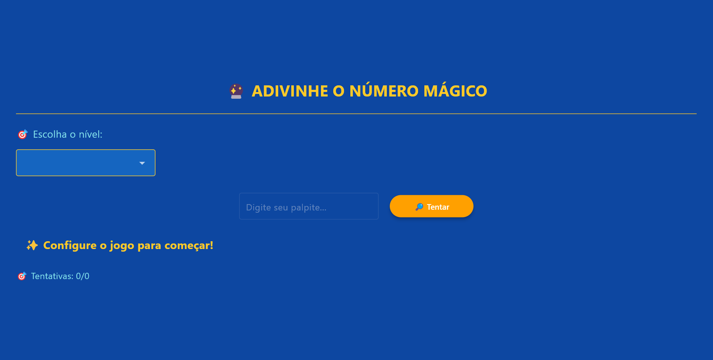

# 🔮 Jogo de Adivinhação Interativo

Um jogo de adivinhação de números desenvolvido em **Python** utilizando o framework **Flet** para a interface gráfica. O jogador pode escolher o nível de dificuldade, definir o número de tentativas e tentar descobrir o número mágico gerado aleatoriamente.

---
## 📸 Demonstração

### 📷 Imagem:


### 🎥 Vídeo:


---

## 🎮 Como Funciona

O jogador define:
- Um nível de dificuldade (com intervalo de números diferentes)
- Quantidade de tentativas permitidas

Depois, tenta adivinhar o número oculto com base no intervalo e nas dicas fornecidas:
- `⬆️ MAIOR!` se o número correto for maior que o palpite
- `⬇️ MENOR!` se for menor
- `🎉 Acertou!` se o jogador acertar  

Se as tentativas acabarem, o número correto é revelado.

---

## 📑 Funcionalidades

✅ Interface responsiva para desktop e mobile  
✅ 4 níveis de dificuldade:
- Fácil (1-10)
- Médio (1-30)
- Difícil (1-50)
- Muito Difícil (1-100)

✅ Definição personalizada de tentativas  
✅ Feedback instantâneo com cores e ícones  
✅ Controle de validação de entrada  
✅ Opção para reiniciar a partida  
✅ Dicas dinâmicas: MAIOR ou MENOR  

---

## 🛠️ Tecnologias Utilizadas

- [Python 3.11+](https://www.python.org/)
- [Flet](https://flet.dev/)

---

## ▶️ Como Executar

Se você deseja executar este jogo na sua máquina, siga o passo a passo abaixo:

---

### 📥 1️⃣ Clonar o repositório

Abra o terminal no diretório onde deseja salvar o projeto e execute o comando abaixo para clonar o repositório:

```bash
git clone https://github.com/brunonvsdev/jogo-adivinhacao.git
```
### 📚 2️⃣ Instalar as dependências
Após clonar o repositório, acesse a pasta do projeto na sua IDE ou pelo terminal, e instale a biblioteca necessária para rodar o jogo com o comando:

```bash
pip install flet
```

### 🚀 3️⃣ Executar o jogo
Por fim, para iniciar o jogo, execute o comando abaixo no terminal:
```bash
python app.py
```
O jogo será aberto automaticamente em uma janela ou no navegador padrão. Divirta-se tentando adivinhar o número mágico!


